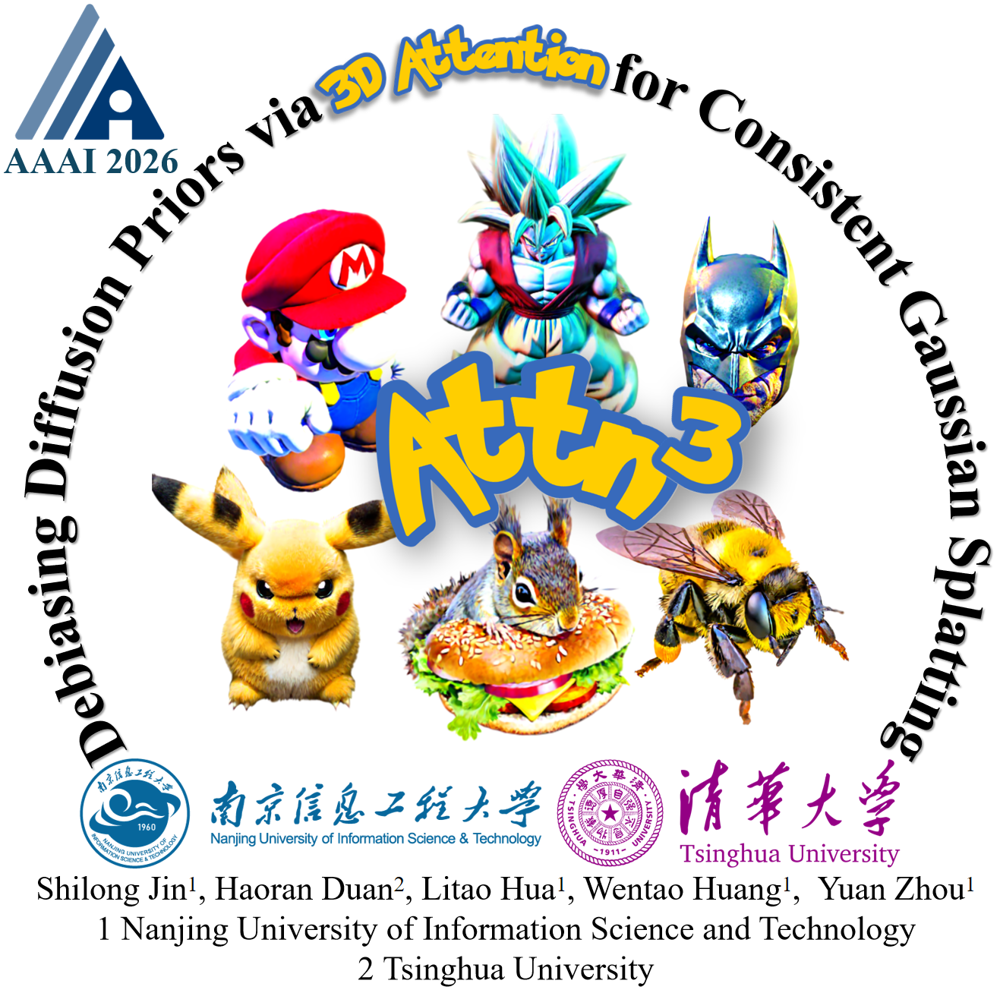
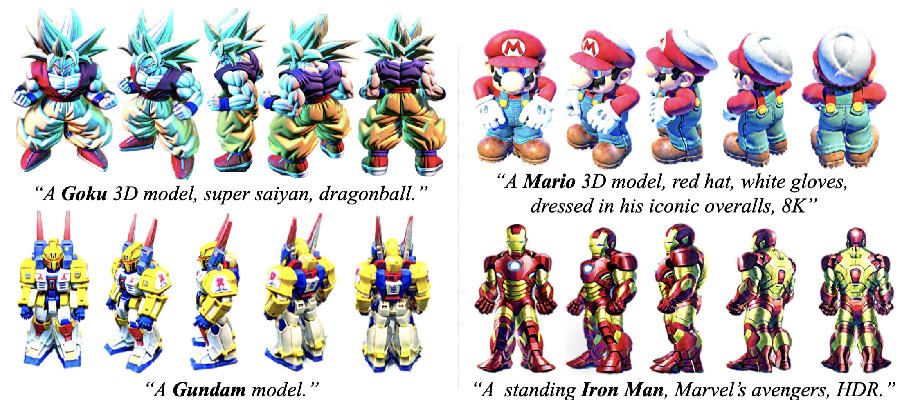
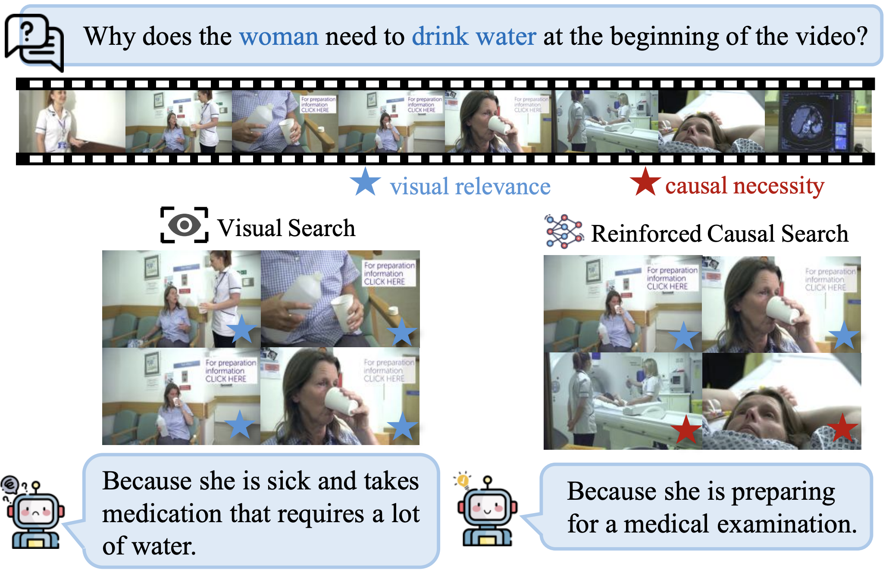
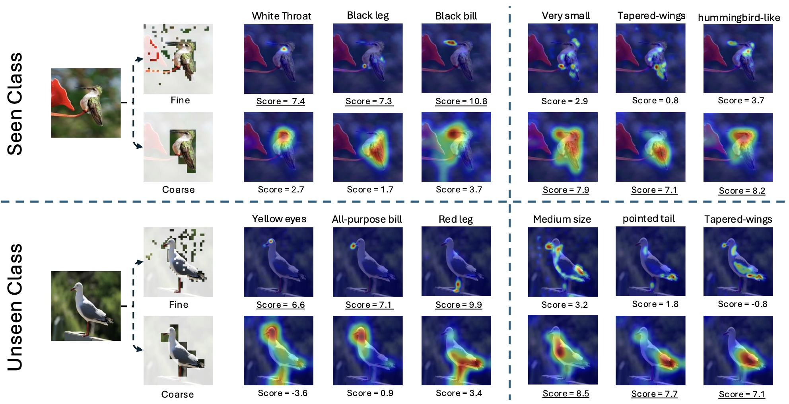
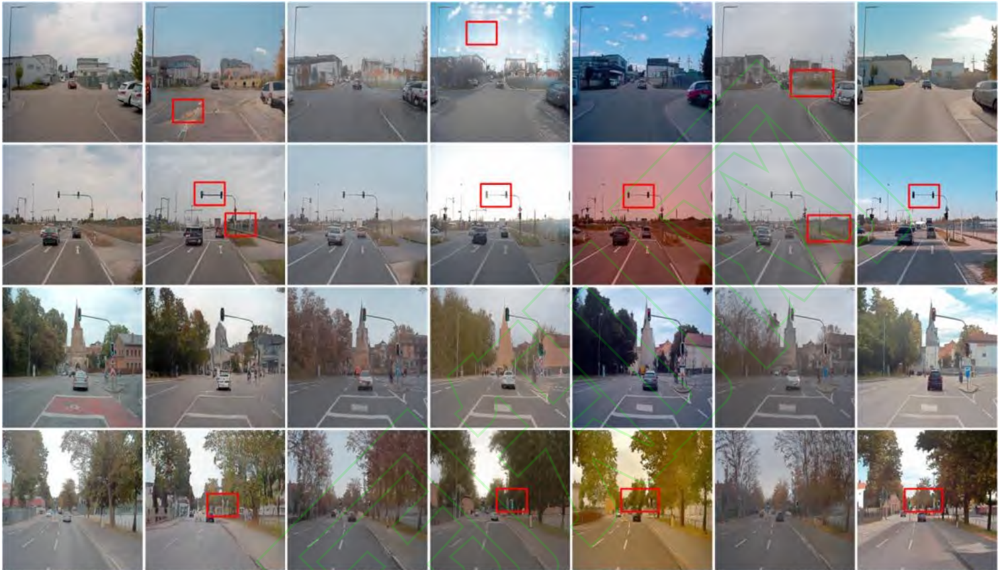

<h1 align="center">Hi, I'm Shilong Jin 👋</h1>

  Third‑year M.S. postgraduate at <b>Nanjing University of Information Science and Technology (NUIST)</b> 
  Supervised by <a href="https://faculty.nuist.edu.cn/YuanZHOU/en/index.htm"><b>Prof. Yuan Zhou</b></a>. Closely working with <a href="https://haoranduan.com/"><b>Haoran Duan</b></a> in Tsinghua University. 
  

  Algorithm Intern at <b>Lenovo Research</b> (Beijing HQ).

  
  

---

### 🔥 News

<ul>
  <li>2025.11: 🎉 My <b>first‑author</b> paper <a href="https://github.com/kimslong/AAAI26-TDAttn"><b>TD‑Attn</b></a> — <b>accepted</b> to  </li>
  <li>2025.11: 🎉 I contributed to <a href="https://github.com/robin-hlt/AAAI26-ReaSon"><b>ReaSon</b></a> — <b>accepted</b> to  </li>
  <li>2025.10: 🎉 I contributed to <a href="https://github.com/GAInuist/ZeroDINO"><b>ZeroDINO</b></a> — <b>accepted</b> to  </li>
  <li>2025.09: 💼 Algorithm Intern at <b>Lenovo Research</b> (Beijing HQ)</li>
  <li>2025.04: 📰 <a href="https://github.com/GAInuist/ConsDreamer"><b>ConsDreamer</b></a> released on arXiv  (<i>Revised and resubmitted to IEEE‑TIP</i>)</li>
  <li>2023.09: 🎓 Started postgraduate studies at <b>NUIST</b>, supervised by <a href="https://faculty.nuist.edu.cn/YuanZHOU/en/index.htm"><b>Prof. Yuan Zhou</b></a></li>
</ul>

---

### 🎮 Hobbies & Achievements

<table style="border-collapse: collapse; width: 100%;">
  <tr style="height: auto;">
    <!-- 图片列：限制高度，保持扁的核心 -->
    <td width="20%" style="padding: 0; margin: 0; vertical-align: middle; height: 100%;">
      
    </td>
    <!-- 第一文字列：Game for Peace 内容 -->
    <td width="42.5%" style="padding: 0 1px; margin: 0; vertical-align: middle; line-height:0.1; font-size: 4px;">
      <b>Game for Peace</b> 
      Invincible Warlord ×4 🏆 [SS4, SS8, SS12, SS20] 
      Peak Grandmaster ×2 🏆 [SS10, SS18] 
      Top 100 in Peak Competition 🏆 [SS26]
    </td>
    <!-- 第二文字列：PUBG Mobile 内容 -->
    <td width="42.5%" style="padding: 0 0 0 5px; margin: 0; vertical-align: middle; line-height: 1.3; font-size: 5px;">
      <b>PUBG Mobile</b> 
      Rankings: China #9 · Asia #14 🥇
    </td>
  </tr>
</table>

### 📝 Papers

<table>

  <tr>
    <td width="30%">
      
    </td>
    <td>
      <b>Debiasing Diffusion Priors via 3D Attention for Consistent Gaussian Splatting</b> 
      Authors: <b>Shilong Jin</b>, Haoran Duan, Litao Hua, Wentao Huang, Yuan Zhou 
      
      
       
      
      
    </td>
  </tr>

  <!-- 论文2 -->
  <tr>
    <td width="30%">
      
    </td>
    <td>
      <b>ConsDreamer: Advancing Multi-View Consistency for Zero-Shot Text-to-3D Generation</b> 
      Authors: Yuan Zhou (Supervisor), <b>Shilong Jin</b>, Litao Hua, Wanjun Lv, Haoran Duan, Jungong Han 
      
      
    </td>
  </tr>

  <!-- 论文3 -->
  <tr>
    <td width="30%">
      
    </td>
    <td>
      <b>ReaSon: Reinforced Causal Search with Information Bottleneck for Video Understanding</b> 
      Authors: Yuan Zhou, Litao Hua, <b>Shilong Jin</b>, Wentao Huang, Haoran Duan 
      
      
       
      
      
    </td>
  </tr>
 

  <!-- 论文4 -->
  <tr>
    <td width="30%">
      
    </td>
    <td>
      <b>ZeroDINO: Entropy-Driven Granularity-Aware Semantic Fusion for Zero-Shot Learning</b> 
      Authors: Zhixuan Deng, Yifan Zhu, Lei Xiang, <b>Shilong Jin</b>, Haoran Duan, Yang Long,Yuan Zhou 
         
      
    </td>
  </tr>

  <tr>
    <td width="30%">
      
    </td>
    <td>
      <b>Dual Semantic-Controlled Conversion of Virtual to Real Images for Maritime Unmanned Boats</b> 
      Authors: Fan Liu, Qiqiang Wang, Yifan Zhu, <b>Shilong Jin</b>, Yuan Zhou 
       
         
         
        
      
</table>

---

### ✉️ Contact

- Email (school): <a href="mailto:shilong.jin@nuist.edu.cn">shilong.jin@nuist.edu.cn</a>
- Email (personal): <a href="mailto:shilonnng@gmail.com">shilonnng@gmail.com</a>

<!--
Notes for editing:
- Replace the four publication rows with your real titles, authors, and links.
- Swap the placeholder cover images with your paper covers or teasers.
- If you add more works later, copy a row block and paste another below.
-->
