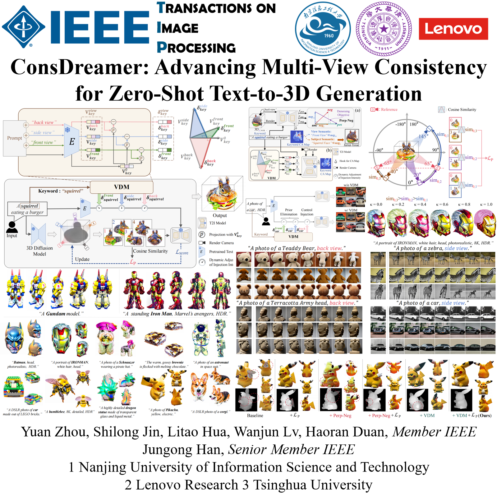
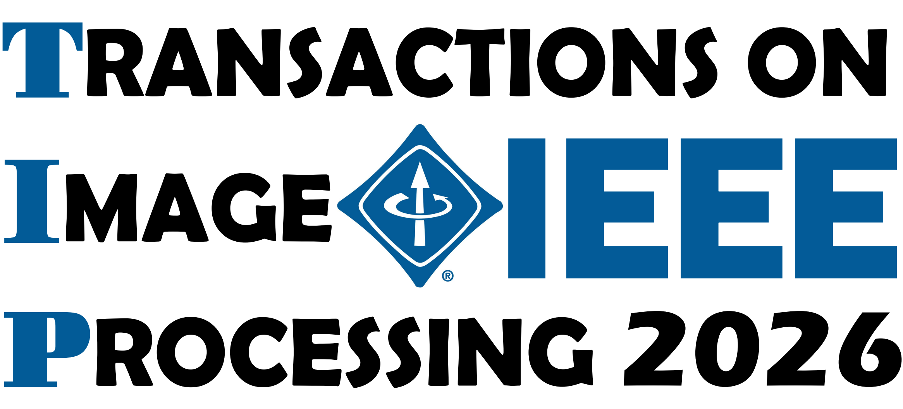
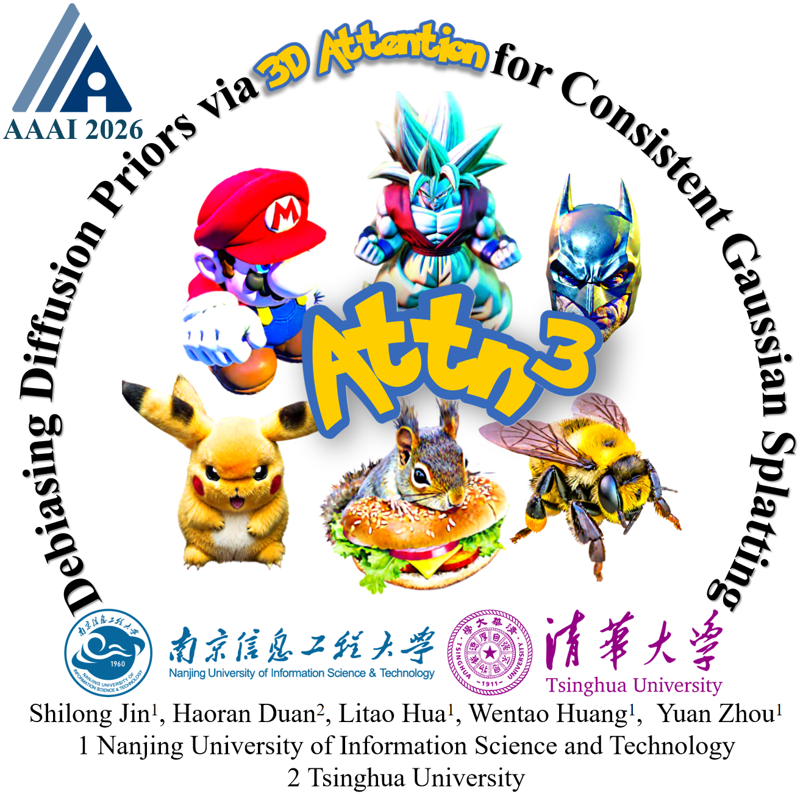
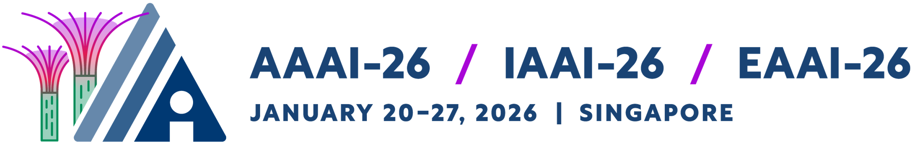
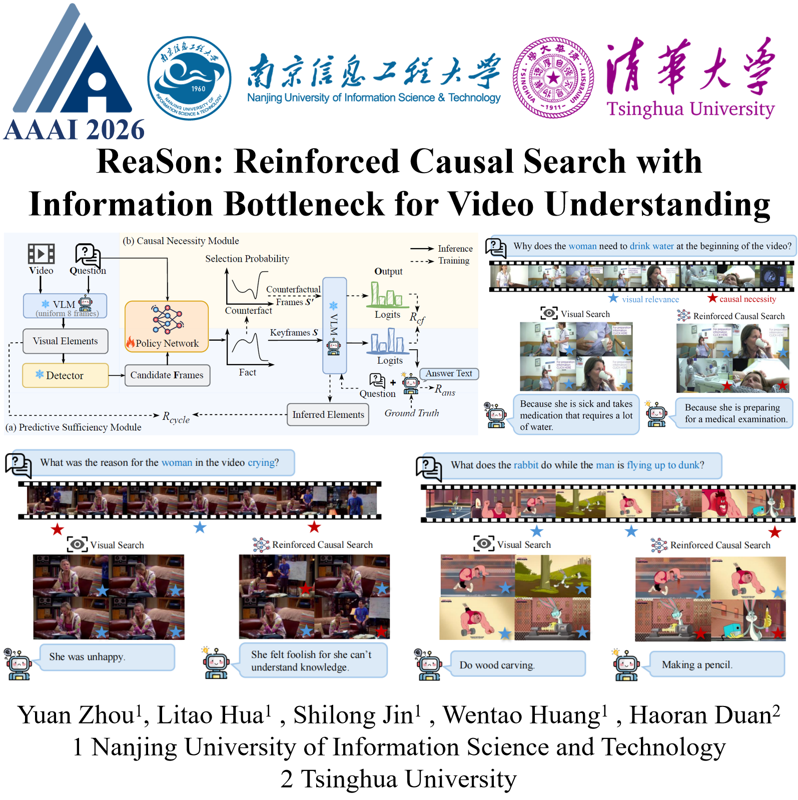
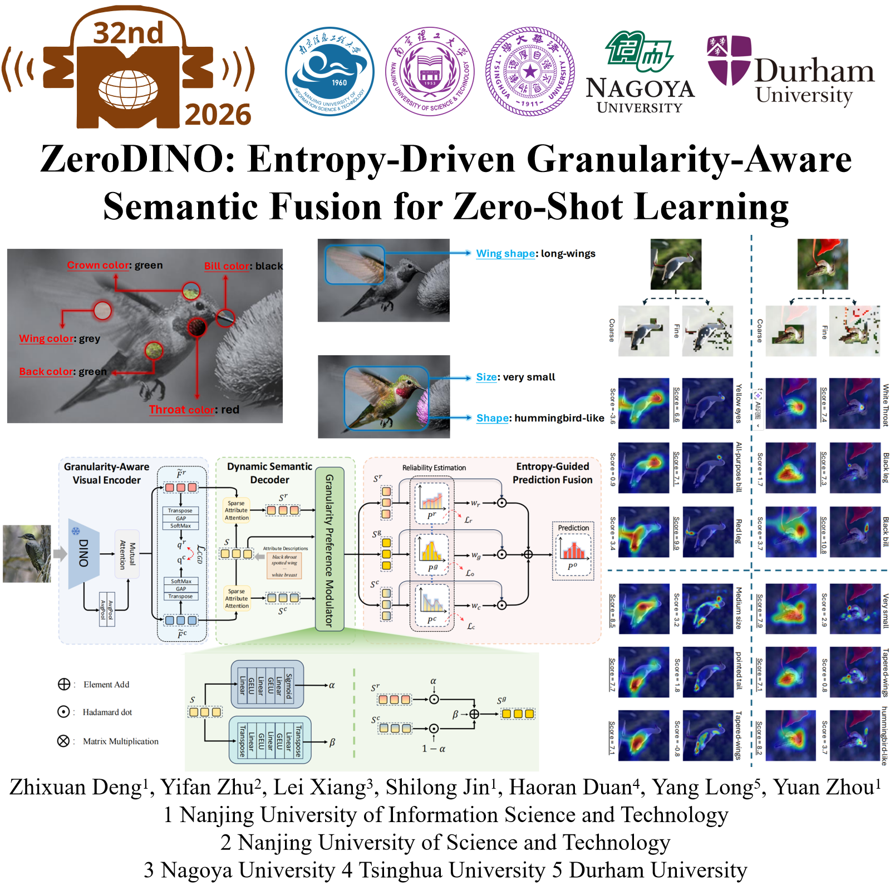
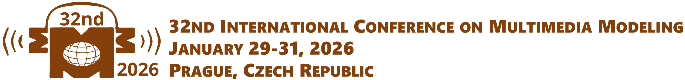
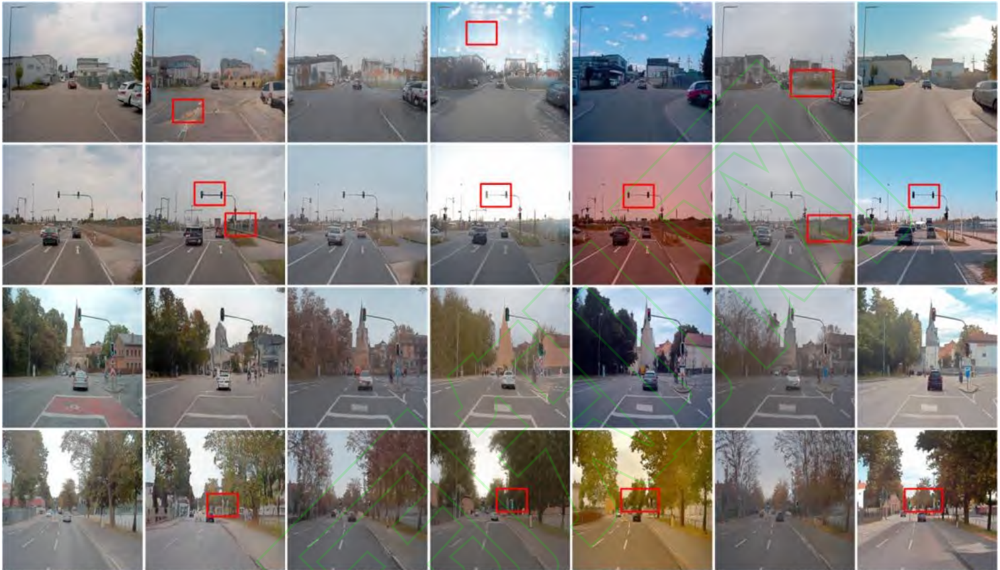

<h1 align="center">Hi, I'm Shilong Jin 👋</h1>

  Third‑year M.S. postgraduate at <b>Nanjing University of Information Science and Technology</b> 
  Supervised by Prof. Yuan Zhou</b></a>. Closely working with <a href="https://haoranduan.com/"><b>Haoran Duan</b></a> in Tsinghua University. 
  

  Algorithm Intern at <b>Lenovo Research</b> (Beijing HQ).

  
  

---

### 🔥 News

<ul>
<!--  <li>2026.02: 📰 <a href="https://github.com/GAInuist/ConsDreamer"><b>ConsDreamer</b></a> released — <b>Accepted with Mandatory Revisions</b> for <b>IEEE T-IP</b> 
    
    
    </li> -->
  <li>2025.11: 🎉 My Paper <a href="https://github.com/kimslong/AAAI26-TDAttn"><b>TD‑Attn</b></a> — <b>accepted to AAAI'26</b> </li>
  <li>2025.11: 🎉 My Paper <a href="https://github.com/robin-hlt/AAAI26-ReaSon"><b>ReaSon</b></a> — <b>accepted to AAAI'26</b> </li>
  <li>2025.10: 🎉 My Paper <a href="https://github.com/GAInuist/ZeroDINO"><b>ZeroDINO</b></a> — <b>accepted to MMM'26</b> </li>
  <li>2025.09: 💼 Algorithm Intern at <b>Lenovo Research</b> (Beijing HQ)  </li>
  <li>2025.04: 📰 <a href="https://github.com/GAInuist/ConsDreamer"><b>ConsDreamer</b></a> released on arXiv (<b>AQ</b> for <i>IEEE Transactions on Image Processing</i> (<b>IEEE T-IP</b>))</li>
  <li>2023.09: 🎓 Started postgraduate studies at <b>NUIST</b>, supervised by <a href="https://faculty.nuist.edu.cn/YuanZHOU/en/index.htm"><b>Prof. Yuan Zhou</b></a></li>
</ul>

---

### 📝 Papers

<!-- 论文1：独立表格
<table style="background-color: white !important; border: none;">
  <tr style="background-color: white !important; border: none;">
    <td width="30%" style="background-color: white !important; border: none; padding: 8px 0;">
      
    </td>
    <td style="background-color: white !important; border: none; text-align: center; padding: 8px 0;">
        
      
      
      
       
      <b>ConsDreamer: Advancing Multi-View Consistency for Zero-Shot Text-to-3D Generation</b> 
     Authors: Yuan Zhou, <b style="font-size: 1.3rem;">Shilong Jin</b>, Litao Hua, Wanjun Lv, Haoran Duan, Jungong Han 
      
      
    </td>
  </tr>
</table>-->

<!-- 论文2：独立表格 -->
<table style="background-color: white !important; border: none;">
  <tr style="background-color: white !important; border: none;">
    <td width="30%" style="background-color: white !important; border: none; padding: 8px 0;">
      
    </td>
    <td style="background-color: white !important; border: none; text-align: center; padding: 8px 0;">
        
      
      
       
      <b>Debiasing Diffusion Priors via 3D Attention for Consistent Gaussian Splatting</b> 
      Authors: <b>Shilong Jin</b>, Haoran Duan, Litao Hua, Wentao Huang, Yuan Zhou 
      
      
    </td>
  </tr>
</table>

<!-- 论文3：独立表格 -->
<table style="background-color: white !important; border: none;">
  <tr style="background-color: white !important; border: none;">
    <td width="30%" style="background-color: white !important; border: none; padding: 8px 0;">
      
    </td>
    <td style="background-color: white !important; border: none; text-align: center; padding: 8px 0;">
        
      
      
       
      <b>ReaSon: Reinforced Causal Search with Information Bottleneck for Video Understanding</b> 
      Authors: Yuan Zhou, Litao Hua, <b>Shilong Jin</b>, Wentao Huang, Haoran Duan 
      
      
    </td>
  </tr>
</table>

<!-- 论文4：独立表格 -->
<table style="background-color: white !important; border: none;">
  <tr style="background-color: white !important; border: none;">
    <td width="30%" style="background-color: white !important; border: none; padding: 8px 0;">
      
    </td>
    <td style="background-color: white !important; border: none; text-align: center; padding: 8px 0;">
         
      
      
       
      <b>ZeroDINO: Entropy-Driven Granularity-Aware Semantic Fusion for Zero-Shot Learning</b> 
      Authors: Zhixuan Deng, Yifan Zhu, Lei Xiang, <b>Shilong Jin</b>, Haoran Duan, Yang Long,Yuan Zhou 
      
      
    </td>
  </tr>
</table>

<!-- 论文5：独立表格 -->
<table style="background-color: white !important; border: none;">
  <tr style="background-color: white !important; border: none;">
    <td width="30%" style="background-color: white !important; border: none; padding: 8px 0;">
      
    </td>
    <td style="background-color: white !important; border: none; text-align: center; padding: 8px 0;">
       
       
      <b>Dual Semantic-Controlled Conversion of Virtual to Real Images for Maritime Unmanned Boats</b> 
      Authors: Fan Liu, Qihiang Wang, Yifan Zhu, Lei Xiang, <b>Shilong Jin</b>, Yuan Zhou 
       
      
    </td>
  </tr>
</table>

 <!-- 发明专利：独立表格 -->
<table style="background-color: white !important; border: none;">
  <tr style="background-color: white !important; border: none;">
   <td width="30%" style="background-color: white !important; border: none; padding: 8px 0;">
      
    </td>
    <td style="background-color: white !important; border: none; text-align: center; padding: 8px 0;">
      
      
       
      <b>一种增强视角一致性的零样本3D生成方法</b> 
      Inventors: Yuan Zhou, <b style="font-size: 1.3rem;">Shilong Jin</b> 
    </td>
  </tr>
</table>

---
### 💼 Internships

<!-- 实习1：Lenovo Research - 优化后布局 -->
<table style="background-color: white !important; border: none; width: 100%;"> <!-- 关键：添加width:100%让表格占满宽度 -->
  <tr style="background-color: white !important; border: none;">
    <!-- 调整列宽为30%（logo列），更贴合视觉比例 -->
    <td width="40%" style="background-color: white !important; border: none; padding: 8px 0; text-align: center;">
      <!-- 图片宽度调整为80%（相对于列），显示更合理 -->
      
    </td>
    <!-- 文字列占70%，填充右侧空间 -->
    <td width="60%" style="background-color: white !important; border: none; text-align: left; padding: 8px 16px; line-height: 1.8;">
      <b style="font-size: 1.8rem;">Lenovo Research (Beijing HQ)</b>  
      CTOO Human-centered Innovation Intelligence and Insights 
      <b style="font-size: 1.8rem;">Algorithm Intern </b>· Sep. 2025 – Jan. 2026 
      Hand-Eye Intent Interaction Understanding · Pose Estimation Algorithms
    </td>
  </tr>
</table>

---

### 🔬 Research Interests

- 🐿 3D Generation & Editing
- ✋ Hand Reconstruction & Pose Estimation
- 🤖 Embodied Intelligence & World Model
- 🎬 Video Understanding

---
### 👥 My Circle

- 👨‍🏫 Advisor: <a href="https://faculty.nuist.edu.cn/YuanZHOU/en/index.htm"><b>Yuan Zhou</b></a> — NUIST
- 🤝 Clooooooooose collaborator: <a href="https://haoranduan.com/"><b>Haoran Duan</b></a> — Tsinghua University  
- 🧑‍🔬 Labmates: <a href="https://robin-hlt.github.io/"><b>Litao Hua</b></a>, <a href="https://github.com/huangHH73"><b>Wentao Huang</b></a>, <b>Zhixuan Deng</b></a> (NUIST);
<b>Lei Xiang</b> (Nagoya University); <b>Yifan Zhu</b> (NJUST)

---

### 🎮 Hobbies & Achievements

<table style="border-collapse: collapse; width: 100%;">
  <tr style="height: auto;">
    <!-- 图片列：限制高度，保持扁的核心 -->
    <td width="34%" style="padding: 0; margin: 0; vertical-align: middle; height: 100%;">
      
    </td>
    <!-- 第一文字列：Game for Peace 内容 -->
    <td width="42.5%" style="padding: 0 1px; margin: 0; vertical-align: middle; line-height:0.1; font-size: 4px;">
      <b>Game for Peace</b> 
      Invincible Warlord ×4 🏆 [SS4, SS8, SS12, SS20] 
      Peak Grandmaster ×2 🏆 [SS10, SS18] 
      Top 100 in Peak Competition 🏆 [SS26]
    </td>
    <!-- 第二文字列：PUBG Mobile 内容 -->
    <td width="42.5%" style="padding: 0 0 0 5px; margin: 0; vertical-align: middle; line-height: 1.3; font-size: 5px;">
      <b>PUBG Mobile</b> 
      Rankings: China #9 · Asia #14 🥇
    </td>
  </tr>
</table>

---

